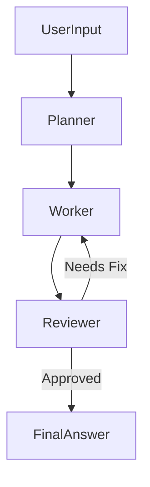

# Agent Schema & Architecture Best Practices

Dokumen ini merangkum pola arsitektur (Pattern) dan skema memori untuk AI Agent modern, diambil dari standar industri (LangGraph/LangChain).

## 1. Core Concept: State Schema
Jantung dari Agent cerdas adalah **State**. State bukan hanya log chat, tapi struktur data yang mendefinisikan "isi otak" agent saat ini.

### Schema Pattern (TypeScript/Zod)
Gunakan `Zod` untuk validasi runtime yang ketat.

```typescript
import { z } from "zod";
import { MessagesZodState } from "@langchain/langgraph";

// Definisi Struktur Memori Agent
const AgentStateSchema = z.object({
    // 1. Short-term Memory (Chat History)
    messages: MessagesZodState.shape.messages,
    
    // 2. Context / User Profile (Long-term preference)
    userProfile: z.object({
        name: z.string().optional(),
        preference: z.enum(["verbose", "concise"]).default("concise"),
        technicalLevel: z.number().min(1).max(5)
    }),

    // 3. Task State (Apa yang sedang dikerjakan?)
    currentTask: z.object({
        id: z.string(),
        status: z.enum(["planning", "execution", "review"]),
        steps: z.array(z.string()),
        currentStepIndex: z.number()
    }).nullable(),

    // 4. Scratchpad (Coreat-coretan internal agent)
    thoughts: z.array(z.string()).describe("Internal monologue or reasoning steps")
});

// Type inference
type AgentState = z.infer<typeof AgentStateSchema>;
```

## 2. Architecture: StateGraph vs Linear Chain
Jangan buat agent yang hanya berjalan lurus (A -> B -> C). Gunakan **State Machine** (Graph).

### Node Structure
Agent harus dibagi menjadi node-node spesifik:
- **Planner Node**: Menganalisa request dan memecah menjadi langkah-langkah (update `currentTask`).
- **Worker Node**: Mengeksekusi langkah spesifik (menggunakan Tools).
- **Reviewer Node**: Memeriksa hasil Worker. Jika gagal, kembalikan ke Worker. Jika sukses, lanjut.



## 3. Implementation Checklist
Saat membangun Agent baru:

1. [ ] **Define State**: Apa saja data yang harus diingat agent antar-langkah?
2. [ ] **Define Nodes**: Siapa saja "spesialis" yang terlibat? (Coder, QA, Writer?)
3. [ ] **Define Edges**: Kapan harus pindah dari node A ke B? (Conditional Logic)
4. [ ] **Memory Persistence**: Gunakan `Checkpointer` (seperti SQLite/Postgres) agar agent "ingat" sesi sebelumnya jika server restart.

## 4. Referensi Code (LangGraph Style)
```typescript
const graph = new StateGraph({
    channels: AgentStateSchema
})
.addNode("planner", plannerFunction)
.addNode("worker", workerFunction)
.addNode("reviewer", reviewerFunction)
.addEdge("planner", "worker")
.addConditionalEdges("reviewer", (state) => {
    return state.qualityScore > 80 ? "end" : "worker";
})
.compile();
```

---
*Referensi: LangGraph Documentation (Context7)*
